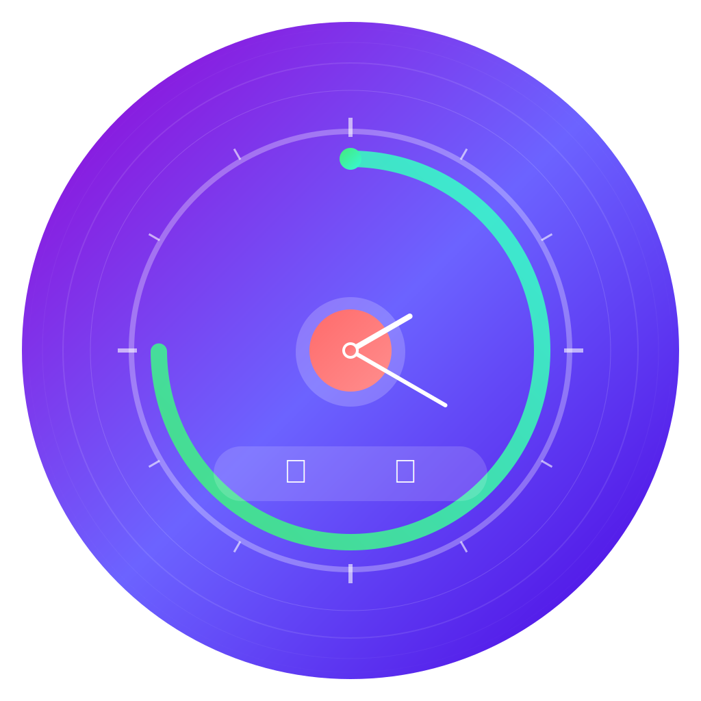

# 🕐 圆时间 (Circle Time)

<div align="center">



**精美的Flutter倒计时应用 · 让时间更有意义**

[](https://flutter.dev/)
[](https://dart.dev/)
[](LICENSE)
[](https://flutter.dev/)

[功能特色](#-功能特色) •
[安装指南](#-安装指南) •
[使用说明](#-使用说明) •
[技术栈](#-技术栈) •
[贡献指南](#-贡献指南)

</div>

---

## 📖 项目介绍

**圆时间**是一款现代化的Flutter倒计时应用，采用精美的圆环进度设计，让时间的流逝变得可视化和有意义。无论是重要的纪念日、节日庆典，还是个人目标，圆时间都能帮您优雅地追踪每一个重要时刻。

### 🎯 设计理念

- **时间视觉化** - 独特的圆环动画让时间流逝更加直观
- **极简美学** - 现代化UI设计，注重用户体验
- **个性定制** - 多种主题色彩和事件类型选择
- **跨平台支持** - 一套代码，多端运行

## ✨ 功能特色

### 🏠 核心功能
- **📅 倒计时管理** - 创建、编辑、删除倒计时事件
- **🎨 动态圆环** - 基于Canvas的实时进度动画
- **⏰ 精确计时** - 精确到秒的实时时间显示
- **📊 数据统计** - 智能统计即将到来和已完成的事件

### 🎭 界面设计
- **🌈 渐变主题** - 10种精美的渐变色彩主题
- **🌙 深色模式** - 支持深色/浅色主题切换
- **✨ 流畅动画** - 丰富的过渡动画和交互反馈
- **📱 响应式布局** - 适配不同屏幕尺寸

### 📦 事件类型
- **🎂 生日倒计时** - 记录重要的生日
- **💕 纪念日倒计时** - 珍藏美好回忆
- **🎊 节日倒计时** - 期待节日庆典
- **🎯 自定义事件** - 个人目标和重要时刻

### 🔍 发现功能
- **🔥 热门模板** - 精选的倒计时模板
- **📅 即将到来** - 智能推荐即将到来的节日
- **🏷️ 分类筛选** - 按类型浏览不同事件

## 📱 应用截图

<div align="center">
<table>
<tr>
<td></td>
<td></td>
<td></td>
<td></td>
</tr>
<tr>
<td align="center">首页</td>
<td align="center">详情页</td>
<td align="center">添加页</td>
<td align="center">发现页</td>
</tr>
</table>
</div>

## 🚀 快速开始

### 📋 环境要求

- **Flutter SDK**: >= 3.32.0
- **Dart SDK**: >= 3.8.0
- **Android Studio** 或 **VS Code**
- **Git**

### 📥 安装指南

1. **克隆仓库**
```bash
git clone https://github.com/your-username/circle-time.git
cd circle-time
```

2. **安装依赖**
```bash
flutter pub get
```

3. **运行应用**
```bash
# Android
flutter run

# iOS (需要macOS)
flutter run

# Web
flutter run -d chrome
```

### 🔧 构建发布版本

```bash
# Android APK
flutter build apk --release

# Android App Bundle
flutter build appbundle --release

# iOS (需要macOS)
flutter build ios --release

# Web
flutter build web --release
```

## 📚 使用说明

### 📝 创建倒计时

1. 点击首页的"+"浮动按钮或导航到"添加"标签
2. 填写倒计时标题和描述
3. 选择目标日期
4. 选择事件类型（生日、纪念日、节日、自定义）
5. 点击"创建倒计时"保存

### 🎨 自定义主题

1. 进入"设置"页面
2. 选择"主题设置"
3. 从10种渐变主题中选择喜欢的颜色
4. 切换深色/浅色模式

### 📊 查看详情

1. 在首页点击任意倒计时卡片
2. 查看精美的圆环动画和实时倒计时
3. 可以分享、编辑或删除倒计时

## 🛠 技术栈

### 🏗 核心技术
- **[Flutter](https://flutter.dev/)** - 跨平台UI框架
- **[Dart](https://dart.dev/)** - 编程语言
- **[Provider](https://pub.dev/packages/provider)** - 状态管理
- **[SQLite](https://pub.dev/packages/sqflite)** - 本地数据存储

### 📦 主要依赖

```yaml
dependencies:
  flutter:
    sdk: flutter
  cupertino_icons: ^1.0.8
  
  # 功能依赖
  provider: ^6.1.2
  shared_preferences: ^2.3.2
  sqflite: ^2.4.1
  path: ^1.9.0
  intl: ^0.19.0
  
  # UI增强
  google_fonts: ^6.2.1
  flutter_colorpicker: ^1.1.0
  animations: ^2.0.11
  animated_text_kit: ^4.2.2
```

### 🎨 UI特色
- **Canvas绘制** - 自定义圆环进度动画
- **Material Design 3** - 遵循最新设计规范
- **流畅动画** - 使用Flutter动画系统
- **响应式设计** - 适配各种屏幕尺寸

## 📁 项目结构

```
lib/
├── main.dart                 # 应用入口
├── models/                   # 数据模型
│   └── countdown_model.dart  # 倒计时数据模型
├── providers/                # 状态管理
│   ├── countdown_provider.dart # 倒计时数据管理
│   └── theme_provider.dart   # 主题管理
├── screens/                  # 页面
│   ├── main_screen.dart      # 主导航页面
│   ├── home_screen.dart      # 首页
│   ├── add_screen.dart       # 添加页
│   ├── detail_screen.dart    # 详情页
│   ├── discover_screen.dart  # 发现页
│   └── settings_screen.dart  # 设置页
├── widgets/                  # 通用组件
│   └── countdown_card.dart   # 倒计时卡片
└── services/                 # 服务层
    └── database_service.dart # 数据库服务
```

## 🎯 路线图

### 🔜 即将推出
- [ ] **云同步** - 支持数据跨设备同步
- [ ] **提醒通知** - 智能提醒功能
- [ ] **更多主题** - 增加更多个性化主题
- [ ] **导出分享** - 导出倒计时为图片/视频

### 💡 未来计划
- [ ] **小组件支持** - 桌面小组件
- [ ] **语音提醒** - 语音播报功能
- [ ] **数据分析** - 时间管理分析
- [ ] **多语言支持** - 国际化

## 🤝 贡献指南

我们欢迎所有形式的贡献！无论是新功能、Bug修复、文档改进或者设计建议。

### 🔧 开发环境搭建

1. Fork本仓库
2. 创建特性分支 (`git checkout -b feature/AmazingFeature`)
3. 提交更改 (`git commit -m 'Add some AmazingFeature'`)
4. 推送到分支 (`git push origin feature/AmazingFeature`)
5. 开启Pull Request

### 📝 代码规范

- 遵循[Dart代码规范](https://dart.dev/guides/language/effective-dart)
- 使用有意义的提交信息
- 添加必要的注释和文档
- 确保代码通过`flutter analyze`检查

### 🐛 报告问题

如果您发现了Bug或有功能建议，请：

1. 检查[Issues](https://github.com/your-username/circle-time/issues)是否已存在相关问题
2. 创建新Issue，详细描述问题或建议
3. 提供复现步骤和环境信息

## 📄 开源协议

本项目基于 [MIT协议](LICENSE) 开源，您可以自由使用、修改和分发。

## 🙏 致谢

- **Flutter团队** - 提供优秀的跨平台框架
- **Material Design** - 设计指导原则
- **开源社区** - 各种优秀的第三方库
- **所有贡献者** - 感谢每一位贡献者的付出

## 📞 联系方式

- **项目地址**: [GitHub](https://github.com/your-username/circle-time)
- **问题反馈**: [Issues](https://github.com/your-username/circle-time/issues)
- **邮箱**: your-email@example.com

---

<div align="center">

**如果这个项目对您有帮助，请给个⭐️Star支持一下！**

Made with ❤️ by [Your Name](https://github.com/your-username)

</div>
